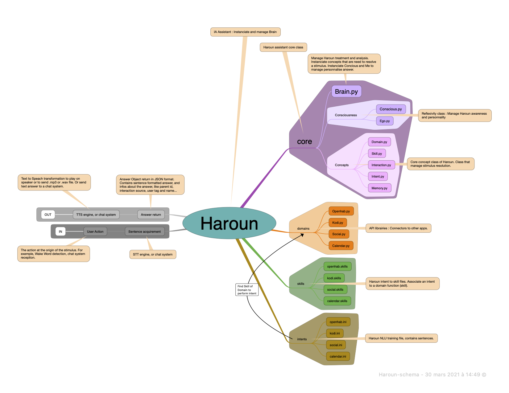
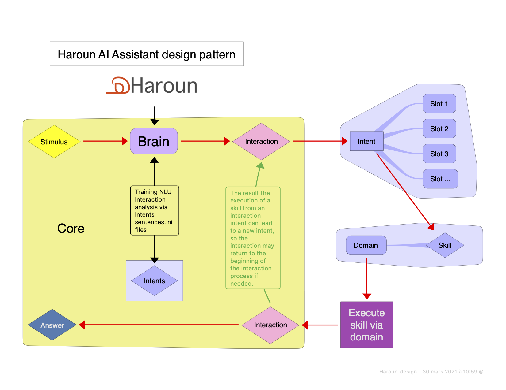
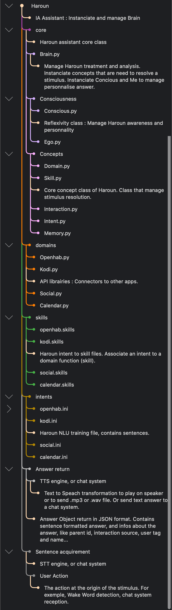

# Haroun
Haroun is a python home assistant. Manage text interaction between user and domains modules.

# What is Haroun ?

Haroun is a python evolutive personnal bot for textual interaction.
Haroun is based on rhasspy NLU python library, it transform text sentence into intent and transmit interpretation information to execute skills on domains modules that manage interpreted interaction. Haroun also have memory and ego, that simulate consciousness, giving each interaction information about Haroun current states of mind to allow domains modules to use them to generate alternatives responses and behaviours.

Haroun brain class recieved stimulus and generate interaction if needed. Then brain manage interaction threw NLU interpretation, intents analysis, skills execution on domains modules and response generation.

Domains modules have to be created in association with intents definition files. Intents names must be defined such as they match domain_name.method_name pattern.
Additionnal domain module specifique slots may be defined in domain module file. (See haroun/core/concept/domain.py)

Domain are python class that are must be named same as the python file. They contains methods that match intents naming and attributs that match intent definition slots. 



# What is the continuation of dev ?

    * RoadMap
    
        • Part 1 :
            
        • Part 2 :
            
        • Part 3 : 
            
        • Part 4 : 
            
        • Part 5 :
            

# Working schema :



# Structure

Haroun.py (Main file launch assistance process. Init brain, receive interaction sentence.)

- Core (Haroun assistant Core files)

    Brain.py (Create and process interaction via NLU and domain, from reception to answer. Manage persistance between interaction via Memory.)
    
  - Concepts (Core Class use by brain to manage assistance)
    • Domain.py (Manage Domain library import and instanciation.)
    • Skill.py (Create and execute API command for interaction via domain)
    • Interaction.py (Store and process sentence via NLU, define intent and slots.)
    • Memory.py (Store data to be trigger by interaction)
    • Intent.py (NLU model of the interaction sentence. Load sentence.ini and slots. Manage slots-apps)
            
  - Consciousness (Awareness simulation)
    • Conscious.py
    • Ego.py
       
- Domains (API libraries for various service)
  • Openhab.py
  • Kodi.py
  • Social.py
  • Calendrier.py
  • Google.py
  • Wikipedia.py 
    
- Intents (Sentence.ini files for rhasspy-nlu)
  • Openhab.ini
  • Kodi.ini
  • Social.ini
  • Calendar.ini
  • ...
    
- Skills (.skills files store association between Intent and Skill)
  • Openhab.skills
  • Kodi.skills
  • Social.skills
  • Calendar.skills
  • ...
    


# Installation :

- Haroun should be placed in folder /opt/haroun
```
  cd /opt
  mkdir haroun
  cd haroun
```

- Retrieve Haroun project.
```
  git clone git@github.com:LounisBou/haroun.git
```

- You should use python 3.8+ for best compatibilities.

- Install librairies requirements.
```
  pip install -r requirement.txt
```

- Test Haroun.
```
  python ./Haroun.py
```

- Install Haroun as service.
```
  sudo cp Haroun.service /etc/systemd/system/Haroun.service
  sudo systemctl daemon-reload
  sudo service Haroun start
```

- See log in /opt/haroun/log/current.log
```
  watch tail -n 50 /opt/haroun/log/current.log
```
