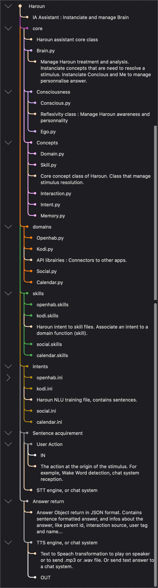

# Haroun
Haroun is a python home assistant. Manage text interaction between user and domains API.

# Operation

# Structure

Haroun.py (Main file launch assistance process. Init brain, receive interaction sentence.)

- Core (Haroun assistant Core files)

    Brain.py (Create and process interaction via NLU and domain, from reception to answer. Manage persistance between interaction via Memory.)
    
  - Concepts (Core Class use by brain to manage assistance)
    • Domain.py (Manage Domain library import and instanciation.)
    • Skill.py (Create and execute API command for interaction via domain)
    • Interaction.py (Store and process sentence via NLU, define intent and slots.)
    • Memory.py (Store data to be trigger by interaction)
    • Intent.py (NLU model of the interaction sentence. Load sentence.ini and slots. Manage slots-apps)
            
  - Consciousness (Awareness simulation)
    • Conscious.py
    • Ego.py
       
- Domains (API libraries for various service)
  • Openhab.py
  • Kodi.py
  • Social.py
  • Calendrier.py
  • Google.py
  • Wikipedia.py 
    
- Intents (Sentence.ini files for rhasspy-nlu)
  • Openhab.ini
  • Kodi.ini
  • Social.ini
  • Calendar.ini
  • ...
    
- Skills (.skills files store association between Intent and Skill)
  • Openhab.skills
  • Kodi.skills
  • Social.skills
  • Calendar.skills
  • ...
    

